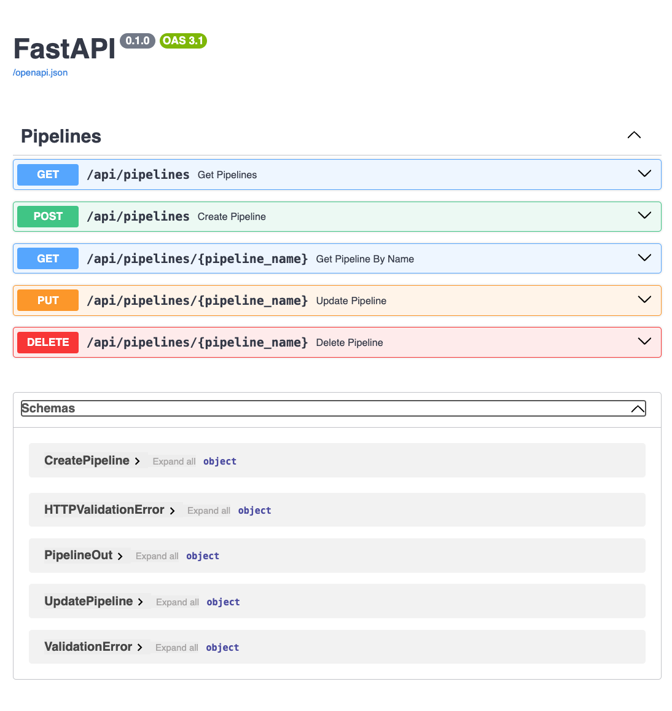

# Snakemake Orchestrator API w/ Kubernetes

## Miro board of design:

https://miro.com/app/board/uXjVKLKSUGQ=/


## Setup

This project uses [Pixi](https://pixi.sh/dev/) to manage packages and the environment.

```bash
# linux / mac os
curl -fsSL https://pixi.sh/install.sh | bash
```

To install the dependencies, run the following command:

```bash
pixi install
```

## Setup

Ensure you have docker and docker-compose installed on your machine.

To make sure that theyre installed, the following commands should return the version of the installed software:

```bash
docker --version
# Docker version 20.10.22, build 3a2c30b

docker-compose --version
# Docker Compose version v2.15.1
```


## Status

