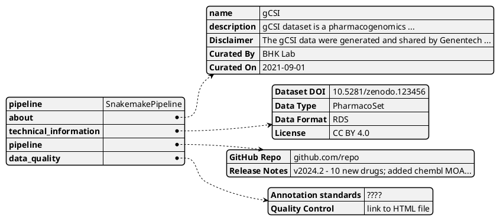

# Data Nutrition Label

We have a [Data Nutrition Label (DNL) Mockup](https://miro.com/app/board/uXjVM9eziFI=/?share_link_id=169608766808)

## Context

Data Nutrition Label (DNL) is a way to communicate the contents and quality of data to the client (user or front-end)

It is expected that the DNL will be generated and stored according to the [Pipeline Storage](Pipeline-Storage.md) documentation.

> QUESTION
> Maybe we can explicitly ask for a `DNL.json` or something upon submission of a pipeline?

As this data structure is designed, we can then standardize what needs to be outputted from the pipeline and how the API will reference those outputs.

## Standards across ALL datasets

> TODO:
> Need to decide on the source for each of these fields

This diagram is based on all the sections below:

### ABOUT

| fld         | value                                                                                             | source          | default |
|-------------|---------------------------------------------------------------------------------------------------|-----------------|---------|
| name        | name of pipeline used across databases                                                            | API/client      | NA      |
| description | outputted from the pipeline metadata file                                                         | Pipeline Output | NA      |
| Disclaimer  | some disclaimer indicating usage?  see [disclaimer](docs/topics/Data-Nutrition-Label.md:26) below | Pipeline Output | NA      |
| Curated By  | Group that curated the pipeline                                                                   | API/client      | BHK Lab |
| Curated On  | Date of curation should be outputted as well                                                      | Pipeline Output | NA      |

**Disclaimer** Data Usage Policy:The gCSI data were generated and shared by Genentech as part of the Genentech Cell Line Screening Initiative
(Eva Lin, Yihong Yu, Scott Martin, Department of Discovery Oncology). The Haibe-Kains Lab has reprocessed and re-annotated the data to maximize
overlap with other pharmacogenomic datasets.

### Technical Information

| fld         | value                                                                            | source                             | default                                  |
|-------------|----------------------------------------------------------------------------------|------------------------------------|------------------------------------------|
| Dataset DOI | Zenodo DOI of the dataset                                                        | API/server                         | NA                                       |
| Data Type   | Type of data (e.g `MultiAssayExperiment`, `PharmacoSet`, `SummarizedExperiment`) | client/Pipeline Output             | NA                                       |
| Data Format | Format of data (e.g `rds`, `csv`, `tsv`, `txt`)                                  | client/Pipeline Output             | NA                                       |
| License     | License of the data (e.g `CC BY 4.0`, `MIT`, `GPL-3`)                            | github repo/pipeline output/client | Creative Commons Attribution 4.0 license |

### Pipeline & Release Notes

> NOTE: Unsure if docker images are necessary for these pipelines

> NOTE: I'm in favor of combining the pipeline and release notes into one section

| fld           | value                                                     | source          | default |
|---------------|-----------------------------------------------------------|-----------------|---------|
| GitHub Repo   | URL of the GitHub repository where the pipeline is stored | API/client      | NA      |
| Release Notes | Notes on the pipeline release                             | repo/API/client | NA      |

### Data Quality

| fld                  | value                                                 | source | default |
|----------------------|-------------------------------------------------------|--------|---------|
| Annotation standards | ????                                                  | ????   | ????    |
| Quality Control      | Link to an HTML file with the quality control metrics | ????   | ????    |
