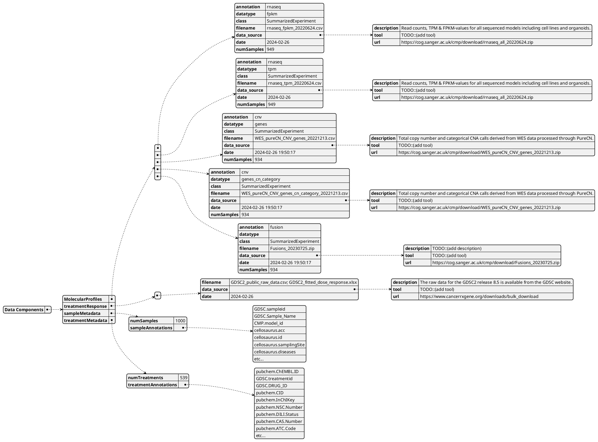

# Pharmacoset-Specific

These are the PharmacoSet Specific DNL requirements


## PharmacoSet



### Python Pydantic class definitions of the json


```Python
import datetime
from typing import List, Optional
from pydantic import BaseModel, Field

class DataSource_DNL(BaseModel):
    description: str
    tool: Optional[str] = None
    url: str

class MolecularProfile_DNL(BaseModel):
    annotation: str
    datatype: str
    class_: str = Field(alias="class")
    filename: str
    data_source: DataSource_DNL
    date: datetime.datetime
    numSamples: int

class TreatmentResponse_DNL(BaseModel):
    filename: str
    data_source: DataSource_DNL
    date: datetime.datetime

class SampleMetadata_DNL(BaseModel):
    numSamples: int
    sampleAnnotations: List[str]

class TreatmentMetadata_DNL(BaseModel):
    numTreatments: int
    treatmentAnnotations: List[str]

class PharmacoSet_DNL(BaseModel):
    MolecularProfiles: List[MolecularProfile]
    treatmentResponse: List[TreatmentResponse]
    sampleMetadata: SampleMetadata
    treatmentMetadata: TreatmentMetadata

```
