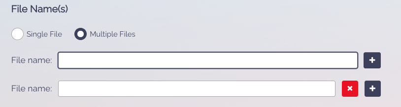

# Pipeline Storage

This document outlines how a pipeline will store its outputs and how the API will reference those outputs.

## Snakemake

In `Snakemake`, the outputs of a rule are stored in the `output` directive.
- This directive is a list of files that `Snakemake` expects the rule will produce.
- If any of the files in the `output` directive do not exist, the rule will be run.

### Basic example

In the following example, running
`snakemake --cores 1`
will result in looking for where `output.txt` is produced.
If `output.txt` does not exist, the rule `my_rule` will be run.

``` python
rule all:
    input:
        "results/output.txt"

rule my_rule:
    input:
        "rawdata/input.txt"
    output:
        "results/output.txt"
    shell:
        "cat {input} > {output}"
```

### Snakemake Storage Plugins

`Snakemake` has a [plugin system](https://snakemake.github.io/snakemake-plugin-catalog/) that allows for the storage of outputs in different locations.
- This is useful for storing outputs in a cloud storage system like `AWS S3` or `Google Cloud Storage`.
- i.e The [HTTP plugin](https://snakemake.github.io/snakemake-plugin-catalog/plugins/storage/http.html) will likely be used in the pipelines to retrieve
    `rawdata` from publicly available sources.

The idea for the `API` is to take any pipeline and run it so that all the `outputs` are stored in a
cloud storage system; [Google Cloud Storage](https://snakemake.github.io/snakemake-plugin-catalog/plugins/storage/gcs.htmll) in this case.

This can be achieved by appending
`--default-storage-prodivder gcs` to the `snakemake` command.

This requires a dedicated bucket for all the pipelines. For the sake of this example, the bucket will be called `orcestra-data-public`.

We would then append
`--default-storage-provider gcs --default-storage-prefix gs://orcestra-data-public` to the `snakemake` command.

In the above example, this would then upload the `output.txt` to `gs://orcestra-data-public/results/output.txt` (assuming no errors occur).


## API Reference to Outputs

The requirements for the API would be:

1) Establish a `Name` of each pipeline
   * This would be used in the `API` to reference the pipeline itself for the front-end (pipeline selection) and used to generate the `GCS prefix` for the pipeline outputs.
2) Upon submission of a pipeline, the user needs to specify `outputs` by their _relative paths_ to the root directory.
   * This will then be used by the `API` **_after_** the pipeline is run, to retrieve the outputs from the `GCS`
   * The `API` can then expose the outputs to the user/front-end client

Like the previous orcestra implementation, except instead of just `file name` it should the `relative path`(s) to the root directory.



So if this is the given info (random example and not a real pipeline):

```json
{
  "_id": {
    "$oid": "6616c22cc823c5691e050680"
  },
  "name": "test_pipeline",
  "git_url": "github.com/repo",
  "output_files": [
    "results/pset.rds",
    "results/dnl.json"
  ],
  "snakefile_path": "./Snakefile",
  "config_file_path": "./config/config.yaml",
  "conda_env_file_path": "./pipeline.yaml"
}
```

After the pipeline runs, the `API` will then retrieve the following files:

1) `gs://orcestra-data-public/test_pipeline/results/pset.rds`
2) `gs://orcestra-data-public/test_pipeline/results/dnl.json`

because the <name> of the pipeline is `test_pipeline` and the `outputs` are `results/pset.rds` and `results/dnl.json`.
