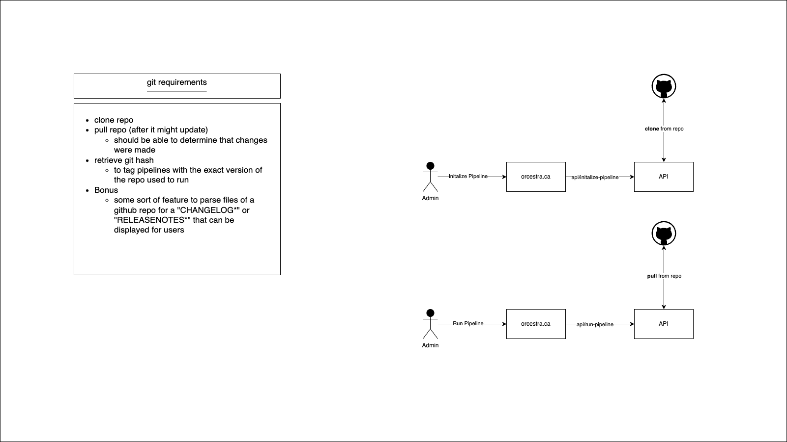
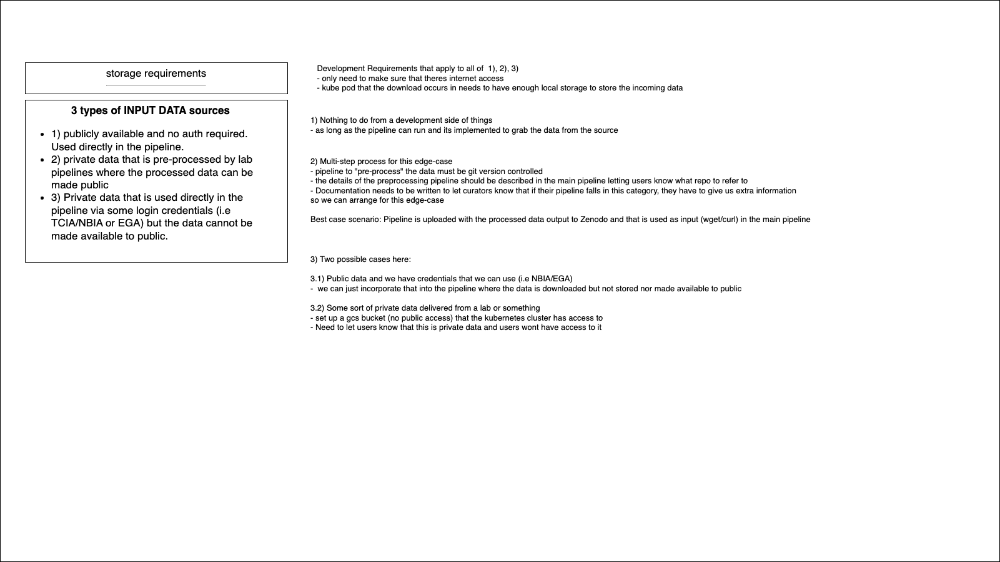
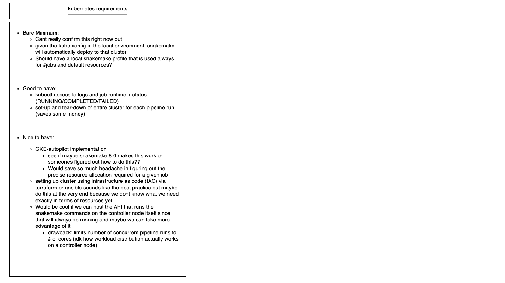
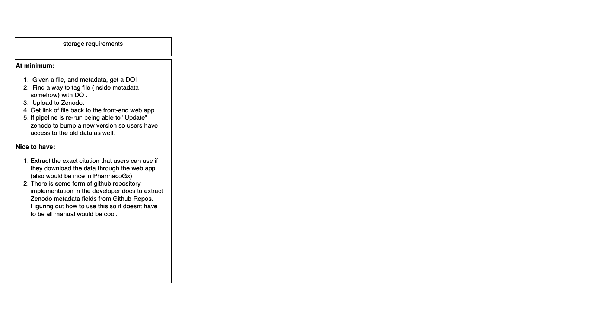

# Requirements Diagrams

Some rough requirements diagrams to help understand the requirements.

- honestly started off as rough drawio diagrams, but I think they are useful enough to keep around or combine into a more formal document
as the architecture evolves.

## Git

## Snakemake

## Storage

## Kubernetes

## Zenodo

